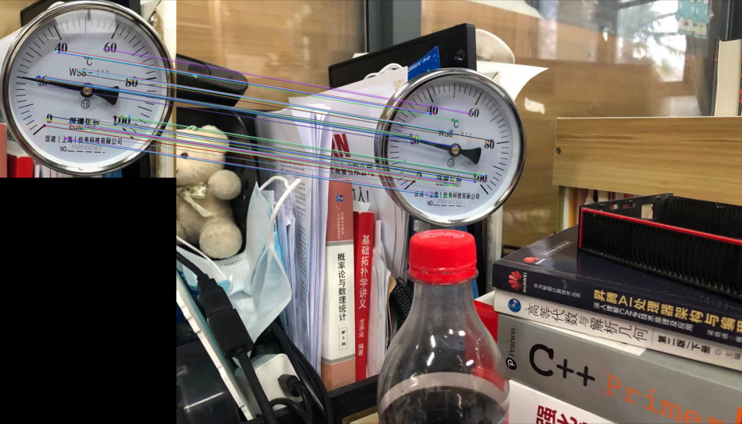
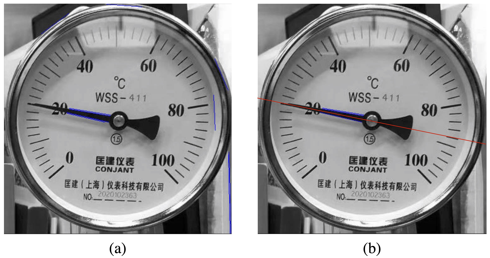
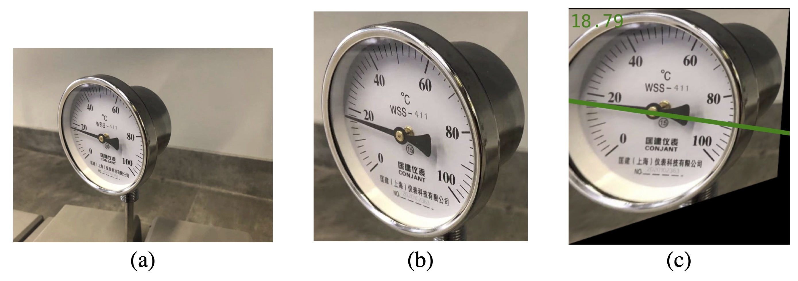

# Gauge_Detector

An ROS gauge reading script for temperature gauge, pressure gauge and level gauge. An extended application could be found [here](https://gitee.com/shineysmile_zy/J1Car).

## Homography correction

## LSD detection

## Reading

